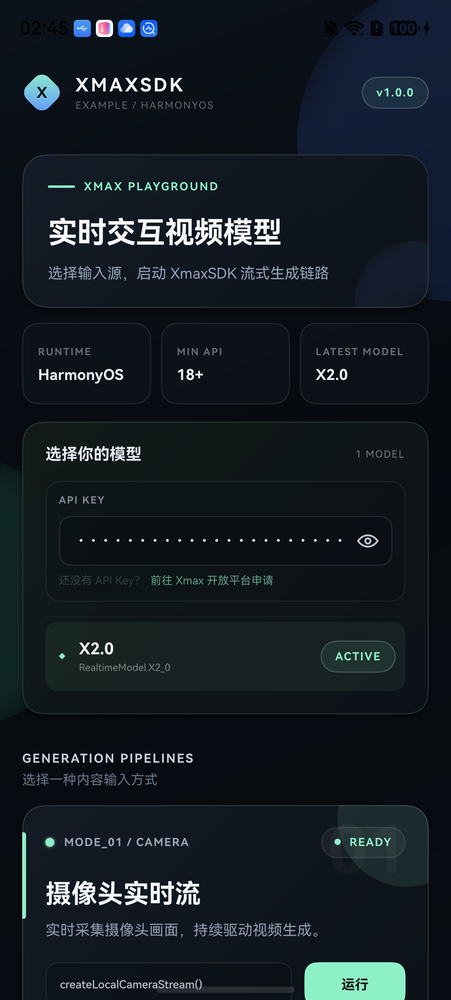
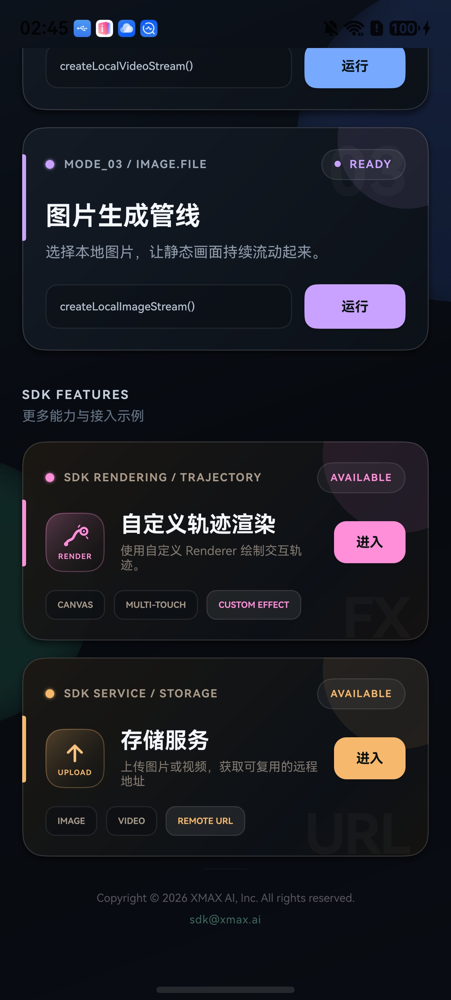
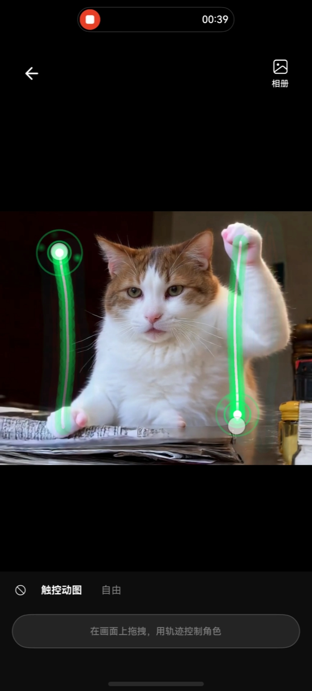

<h1 align="center">XmaxSDK for Android</h1>

<p align="center">
  <a href="https://developer.android.com/about/versions/oreo"></a>
  <a href="https://kotlinlang.org/"></a>
  <a href="https://platform.xmaxai.com/"></a>
  <a href="./LICENSE"></a>
</p>

Native Android SDK, providing access to the real-time interactive video generation
models from Xmax AI. It enables low-latency, high-fidelity video transformations
using live video streams, reference images, and user interactions.
With just a few lines of code, developers can integrate features such as
real-time character swap, virtual try-on, mixed-reality companions,
and interactive image animation directly into their apps.

<p align="center"></p>

<br>

## Features

- Real-time video generation from live camera streams, still images, and local video
  files, guided by prompts, reference images, and user interactions
- In-application rendering of local media input and generated output
- Multi-touch trajectory input for controlling subject movement in generated video
  streams
- Image and video transfer through Xmax-managed object storage
- Asynchronous APIs based on Kotlin coroutines
- Jetpack Compose integration through `AndroidView`

## Requirements

- Android 8.0 (API 26) or later
- JDK 17
- Android SDK 37
- An Xmax API key

> [!WARNING]
> Do not commit an Xmax API key to version control. Supply credentials securely at
> runtime, or use a temporary key issued by the Xmax API. See
> [Authentication](https://platform.xmaxai.com/docs/authentication) for details.

## Installation

The current release is integrated as a source module. Clone this repository adjacent
to the host application, then register the SDK module in `settings.gradle.kts`:

```kotlin
include(":xmax-sdk")
project(":xmax-sdk").projectDir = file("../XmaxSDK-Android/xmax-sdk")
```

Declare the module as an application dependency:

```kotlin
dependencies {
    implementation(project(":xmax-sdk"))
}
```

The SDK module is built with Android Gradle Plugin 9.3.1 and Kotlin 2.3.21. Declare
compatible plugin versions in the root `build.gradle.kts`:

```kotlin
plugins {
    id("com.android.library") version "9.3.1" apply false
    id("org.jetbrains.kotlin.plugin.compose") version "2.3.21" apply false
}
```

Configure the repositories required to resolve the SDK's dependencies:

```kotlin
dependencyResolutionManagement {
    repositories {
        google()
        mavenCentral()
        maven("https://artifact.bytedance.com/repository/Volcengine/")
    }
}
```

`mavenCentral()` resolves third-party dependencies; XmaxSDK itself is not currently
distributed through Maven Central.

## Permissions

For camera-based input, declare the following entries in the application manifest:

```xml
<uses-permission android:name="android.permission.INTERNET" />
<uses-permission android:name="android.permission.CAMERA" />

<uses-feature
    android:name="android.hardware.camera"
    android:required="false" />
```

The host application must obtain camera permission at runtime before creating a
camera stream. If permission is unavailable, XmaxSDK reports an `XmaxError`.

## Getting Started

### Create a client

```kotlin
import ai.xmax.sdk.RealtimeConfiguration
import ai.xmax.sdk.RealtimeModel
import ai.xmax.sdk.XmaxClient
import ai.xmax.sdk.XmaxConfiguration

val client = XmaxClient(
    context = applicationContext,
    configuration = XmaxConfiguration(apiKey = "YOUR_API_KEY"),
)

val realtime = client.createRealtimeManager(
    options = RealtimeConfiguration(model = RealtimeModel.X2_0),
)
```

Realtime operations are exposed as suspending functions and should be invoked from
an application-owned, lifecycle-aware coroutine scope.

Connection-state and error listeners may be registered on the realtime manager:

```kotlin
import android.util.Log

realtime.setStateListener { state ->
    Log.i(
        "YourApp",
        "Xmax realtime state: ${state.connectionState}, " +
            "session: ${state.sessionId}, task: ${state.taskId}",
    )
}

realtime.setErrorListener { error ->
    Log.e("YourApp", "Xmax realtime error: ${error.code} ${error.message}")
}
```

### Create an input stream

After camera permission has been granted, create a live camera stream:

```kotlin
import ai.xmax.sdk.CameraPosition
import ai.xmax.sdk.RealtimeVideoFormat

val localStream = realtime.createLocalCameraStream(
    videoFormat = RealtimeVideoFormat(
        width = 704,
        height = 1280,
        fps = 24,
    ),
    position = CameraPosition.FRONT,
)
```

Still images and local video files can also be used as input sources:

```kotlin
val imageStream = realtime.createLocalImageStream(imageUri)
val videoStream = realtime.createLocalVideoStream(videoUri)
```

Only one input stream may be active at a time. Stop the current stream before
selecting a different input source.

### Preview the input

Bind the local stream to an `XmaxVideoView` to render the input preview:

```kotlin
import ai.xmax.sdk.VideoContentMode
import ai.xmax.sdk.XmaxVideoView

val localVideoView = XmaxVideoView(context).apply {
    videoContentMode = VideoContentMode.FILL
    track = localStream.videoTrack
}
```

In Jetpack Compose, embed the view with `AndroidView`:

```kotlin
AndroidView(
    factory = { context -> XmaxVideoView(context) },
    update = { view ->
        view.videoContentMode = VideoContentMode.FILL
        view.track = localStream.videoTrack
    },
)
```

### Start generation

Construct a `RealtimeContext` with a prompt and, when applicable, a remote reference
image URL:

```kotlin
import ai.xmax.sdk.RealtimeContext

val remoteStream = realtime.startGeneration(
    localStream = localStream,
    context = RealtimeContext(
        prompt = "视频中角色替换成参考图中角色",
        referencePath = referenceImageUrl,
    ),
)
```

The returned stream contains the generated video track. Render it with a separate
`XmaxVideoView`:

```kotlin
val remoteVideoView = XmaxVideoView(context).apply {
    videoContentMode = VideoContentMode.FILL
    track = remoteStream.videoTrack
}
```

To update an active generation task, submit a new context containing the revised
prompt or reference image:

```kotlin
realtime.startGeneration(
    RealtimeContext(
        prompt = "将人物服装替换成参考图中的服装",
        referencePath = anotherReferenceImageUrl,
    ),
)
```

### Stop and release resources

```kotlin
realtime.stopGeneration()
realtime.disconnect()
realtime.close()
```

`stopGeneration()` terminates the active generation task while retaining the remote
connection and local preview. `disconnect()` closes the remote session while
preserving the local preview. `close()` releases all local media and RTC resources
and should be called when the realtime workflow is no longer required.

## Touch Interaction

During an active generation task, one or more pointer trajectories may be supplied
through the generated-video view to guide subject motion or initiate scene
interaction. `XmaxVideoView` captures the trajectories and submits them to the
active task; the host application does not need to implement gesture tracking or
coordinate conversion.

Trajectory interaction is enabled by default. Disable it when touch input must be
handled by the surrounding user interface:

```kotlin
remoteVideoView.isInteractionEnabled = false
```

## Reference Image Upload

`RealtimeContext.referencePath` requires a remote image URL. To use an on-device
image, upload it through the storage manager and supply the resulting URL:

```kotlin
val storage = client.createStorageManager()

val uploaded = storage.uploadImageFile(
    file = imageFile,
    contentType = "image/jpeg",
) { progress ->
    println(progress.fractionCompleted)
}

val referenceImageUrl = uploaded.url
```

The storage manager uses temporary credentials obtained from Xmax. Tencent Cloud
credentials are not embedded in the host application.

## Logging

SDK logging is disabled by default and may be enabled for integration diagnostics
and runtime analysis:

```kotlin
val configuration = XmaxConfiguration(
    apiKey = "YOUR_API_KEY",
    loggerOptions = XmaxLoggerOption.all,
)
```

Enabled log entries are written to Logcat with the `XmaxSDK` tag. API keys,
authentication headers, tokens, and response bodies are excluded from log output.

## Example Project

A runnable Jetpack Compose reference application is available in
[`examples/XLab`](https://github.com/XingMai/XmaxSDK-Android/tree/main/examples/XLab).
The application demonstrates realtime generation with camera, image, and local
video inputs, together with custom prompts, reference image selection, and
trajectory rendering.

<p align="center"></p>

## Dependencies

- VolcEngine RTC SDK for Android provides real-time audio and video communication.
- Tencent Cloud COS SDK provides image and video transfer through object storage.

## Feedback

For bug reports and feature requests, use
[GitHub Issues](https://github.com/XingMai/XmaxSDK-Android/issues). For integration
questions and technical support, contact [sdk@xmax.ai](mailto:sdk@xmax.ai).

## License

XmaxSDK is available under the terms of the [MIT License](LICENSE).
