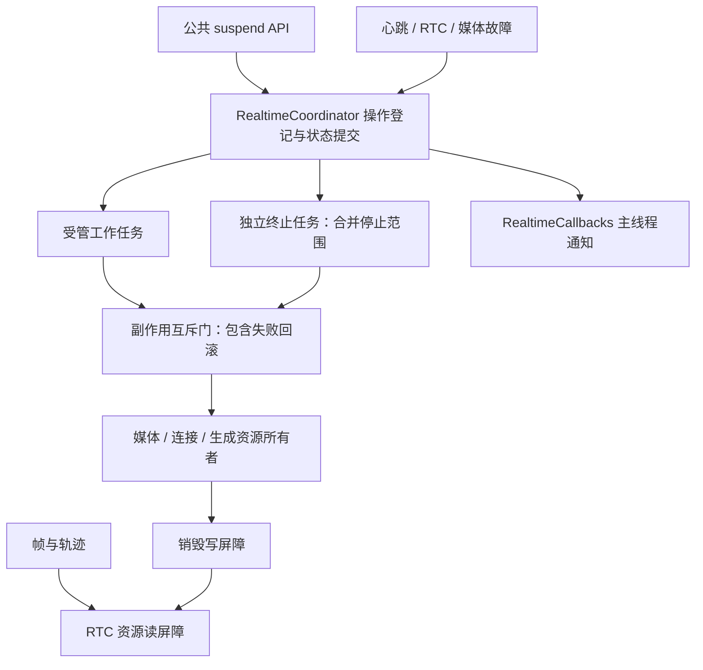

# XmaxSDK 并发与取消架构

状态：已实施。2026-09-05。错误分级与接入示例见 [实时错误契约](REALTIME_ERROR_DESIGN.md)。

## 控制面与资源面

本次采用单一生命周期协调器、资源所有者、可等待补偿清理，以及可注入的运行时工厂。音视频数据继续走独立通道。



`RealtimeCoordinator` 的短临界区完成准入、登记、失效和状态提交，不等待网络、SEI、首帧或资源释放。工作任务与终止任务在锁外运行；它们共享副作用互斥门，保证旧回滚退出后新资源才能被操作。

这保留了原方案中“单一状态所有者、终止优先”的原则。当前实现使用短临界区与独立任务，没有引入 Channel 消息队列、通用 reducer 或多层 ID 类。SDK 当前一次只支持一个媒体源、一条连接和一轮生成，限制在途生命周期操作即可明确所有权；以后确有并行准备多输入的需求，再扩展登记表。

- 一个生命周期操作在准入时登记，之后才启动任务；相互冲突的普通调用返回 RECOVERABLE 错误。
- 音量和监听设置可等待工作门，不挤占生命周期操作槽；待处理设置最多 16 个。调用者可以取消过时的设置。
- 已在生成时再次调用 `startGeneration` 归类为配置操作。调用者只取消这次条件更新不会停止当前生成；`disconnect` 或 `close` 仍会取消它、等待退出后再清理。
- `disconnect` 原子检查活动连接操作和公开状态：即使连接尚未提交 `CONNECTING` 也能取消；完全空闲或已经断开时不重复清理。`close` 始终清理全部运行时资源。
- 同时到达的终止请求合并为最大范围：GENERATION < CONNECTION < ALL。清理期间范围扩大，会补做更大范围的清理。
- `Token` 只允许仍被登记且未失效的操作提交状态。组合式启动在确认已有连接后把失败清理范围从 CONNECTION 收窄为 GENERATION。运行任务完成后，结果被调用者接收或取消清理完成，才释放操作槽。
- 终止完成时先注销受影响的旧操作与终止标记，再派发最终状态和致命错误；监听器可在 `DISCONNECTED` 回调中立即重连或继续 `close`。
- 同一个 runtime 的后台故障由协调器接纳；关闭后重建 runtime，旧组件持有的错误出口无法影响新实例。

入口由 `XmaxRealtimeManager` 编排，`RealtimeComponents` 工厂组装依赖，便于注入可控的会话、媒体、信令和渲染替身。状态和用户错误派发不再由各组件自行修改。

## 公共终止语义

| 调用 | 可撤销的在途操作 | 保留的已提交资源 |
| --- | --- | --- |
| disconnect | 连接与生成操作、相机切换恢复 | 本地媒体、公共监听注册 |
| close | 所有操作与待处理设置 | 公共监听注册及音量配置 |

`close()` 可重复调用，完成后同一个 manager 可以重新创建本地源并连接。下一次明确调用使用新的组件运行时，并恢复相机预览、网络质量和性能告警监听。旧 Runtime 在销毁前仍会解除底层监听，避免继续持有或派发旧资源事件；页面真正销毁时由拥有者显式传 `null` 注销公共监听器。远端音量跨 close 保留，但成功创建新的本地源时与 iOS 一样按来源重置：摄像头和图片为 0，视频为 1；媒体创建失败不改变原音量。

普通源创建/停止互相冲突时会抛非致命错误；要打断正在准备的源，使用 `close()`。连接期间禁止替换本地源。参数验证和流归属检查位于操作准入之后，避免检查完成后被另一生命周期操作改变前提。

## 取消与补偿

所有边界优先保留 `CancellationException`。`XmaxError.from` 遇到协程取消会原样重抛，API 和存储服务也不再将它包装成业务故障。历史 `CANCELLED` 错误码仍保留，等级为 RECOVERABLE。

资源清理使用 `cleanupResources` / `cleanupAfterFailure`：在 NonCancellable 中依次释放，保留首个失败，并把后续清理失败作为 suppressed 错误。只有清理使用 NonCancellable，正常操作仍可取消。

调用者在结果交付前取消时，协调器保持准入占位，等待工作任务退出，再回收其对应资源；这也覆盖“媒体已创建，但结果还没交付”的情况。取消终止请求的等待者不会取消实际清理。

连接所有者的互斥门覆盖创建、提交与回滚；旧连接不能在新连接提交后清空共享 RTC 状态。心跳只提交故障，断开由外部终止任务执行，避免 stopHeartbeat 取消清理自身。

## 后台任务与原生调用

- 图片 stop 等待输出 Job 退出；推帧异常终止当前输出并提交一次故障，不再每帧重复报告。
- 视频预览转换任务归入产生它的视频任务；停止等待解码与预览子任务退出后，再释放音频与预览资源。
- 本地音频预览采用非阻塞写入，预览队列满时可以丢弃样本，避免 AudioTrack 写入持锁阻塞退出。RTC 音频发送仍使用原音频帧。
- 交互轨迹保持“最新采样优先”；stop 等待发送任务退出。单次轨迹失败记日志，不终止生成。
- 会话与房间心跳 stop 都等待任务退出；旧周期结果仍受版本检查。
- RTC 同步调用持有资源读屏障；房间/Engine 销毁持有公平写屏障，等待在途调用返回。读引用与调用之间不再存在销毁空窗。
- Engine 销毁失败会隔离进程级 Engine 管理器：释放互斥锁，但拒绝后续租约，不把原生状态未知当成安全可复用。
- RTC 引擎回调校验租约，已排队的房间/首帧回调校验房间实例，预览与用户监听校验注册版本。
- SEI 生效与 generation stop 共用事件互斥门，防止 stop 清空之后，旧 SEI 又绑定远端流。生成等待器仍以 taskId 匹配。

原生销毁屏障是内存与资源安全保证，不是供应商线程亲和性保证。本次没有更改供应商要求的线程策略。

## 网络与文件提交

`withCancellableConnection` 在取消钩子中断开 HTTP 连接，在结构化子任务中执行阻塞 I/O。与原实现的 Job 完成钩子不同，取消不必等到读取完成才调用 disconnect；外层仍等待工作线程及 finally 退出。

Session.close 是尽力回收，使用 5 秒协程预算。实际返回仍取决于底层 I/O 退出，URLConnection 的连接与读取超时维持 15 秒。不能把预算超时当成原生调用已经结束的证明。

下载复用相同取消桥接，在同目录临时文件中写入并校验长度；提交前检查取消，原子替换成功后才发最终完成通知。同一进程中并发写同一规范化目标路径会被拒绝，互不相同的目标可以并发下载。原子替换是提交点：取消不能撤销已经提交的文件。

COS 上传对完成回调做单次认领，取消时取消 SDK 上传任务；过期的进度/结果被忽略。它仍受供应商取消接口的实际完成语义约束。

## 进入 Generating 的条件

与 iOS 一致，一轮新的生成必须依次完成：当前 taskId 的 SEI 确认、远端新帧就绪、远端音频激活和操作有效性校验，随后提交 `GENERATING` 并返回 `startGeneration()`。已有任务的条件更新继续保持 `GENERATING`。

SEI 选中远端流时，`RenderController` 为本轮创建独立等待对象并取消旧等待；即使房间和用户都没变，也不能复用上一轮的就绪状态。RTC 层通过 `setRemoteVideoSink` 在 `AFTER_POST_PROCESS` 位置获取新的视频帧，替代只触发一次的首帧解码事件。每次接收器注册捕获自己的回调，派发时再次校验注册、房间实例和 Engine 租约。无效尺寸的帧不解除等待，排队中的旧帧也不能唤醒新一轮。

帧接收器在本轮生成期间持续工作，输入固定为后处理后的 I420。`VolcRemoteVideoFrameSink` 将同一输入交给 EGL 渲染器和远端帧回调，不再在首帧后切回原生 VideoCanvas。接收器最多持有一帧原生引用，用于视图晚挂载或重新绑定；换帧、停止和释放时成对解除引用。如果尚未挂载 View，首帧仍可使状态进入 `GENERATING`；后续挂载后继续等待纹理实际显示再淡入。

`setRemoteVideoFrameListener` 通过后台串行队列交付 `RealtimeVideoFrame`。帧包含自行持有的只读 I420 像素、时间戳和旋转角度，可交给异步编码器。没有监听器时不复制像素；慢监听器只保留最新一帧等待派发。每次监听器替换或生成切换递增版本；复制前后及派发时校验版本，旧任务不能将帧交给新监听器。已经开始的回调允许结束，监听器抛错只记诊断日志。断连和 close 都保留注册，只有显式传 `null` 才注销。监听器和串行派发器由 Manager 持有，注册不需要创建 RTC 组件；Runtime 重建也不能使两代回调并行。

`RealtimeTiming.Attempt` 通过协程上下文贯穿一次启动，包含连接、会话创建、RTC 加房、发送信令、匹配 SEI 和首帧就绪时间。外部 SEI 事件捕获当前 Attempt 和 taskId；旧事件只接触旧实例。每次启动最多输出一个成功或失败报告，取消不输出失败，条件更新不重新计时，日志受 performance 选项控制。

停止、断开和关闭都会使当前等待失效并释放接收器。首帧等待仍为 10 秒；超时通过启动调用的既有 fatal 错误路径清理和通知，协程取消保持取消语义。

## 停止生成时的画面切换

`XmaxRealtimeVideoView` 不依赖接入方清空轨道的时机来处理停止。远端渲染失效时，`XmaxVideoView` 先撤销待派发的首帧通知，再通过内部通知让容器取消淡入、关闭远端交互并将本地预览移到前面；随后才解绑远端画布。通知不增加公共监听 API，也不改变 fatal 错误回调契约。

停止生成的远端清理和断开时的轨道重置都会等待主线程执行完成，再继续释放房间资源。派发到主线程发生在获取流事件锁和渲染锁之前，避免后台持锁等待 UI。RTC 事件原本就在主线程交付，远端停止发布事件使用同一显示失效路径。

同一远端轨道可以跨轮保留，但显示回调版本和纹理不能复用。新一轮就绪后创建新纹理，再等待实际显示首帧；上一轮排队的纹理回调、显示回调和淡入动画不能重新盖住本地预览。

## 验证与实际限制

本轮验证：SDK 218 个、XLab 24 个单元测试通过，两模块 Android Lint 无错误，设备测试源码编译通过。本轮没有执行设备测试，不能沿用此前模拟器结果宣称新的 EGL 渲染链路已通过设备验证。

新增测试覆盖旧回滚与新连接隔离、启动途中 close、合并终止、关闭等待者取消、未交付媒体结果回收、条件更新取消、连接状态提交前 disconnect、空闲 disconnect、最终状态回调重入、设置排队与关闭、SEI 等待取消后重试、心跳故障清理、fatal 抛错与单次回调、生成失败保留连接、监听异常隔离、网络阻塞取消、native 在途调用与销毁，以及 Engine 销毁失败隔离。原有测试按新的取消异常契约更新。

测试命令：

```sh
./gradlew :xmax-sdk:testDebugUnitTest :examples:XLab:testDebugUnitTest --offline --console=plain
```

单元测试验证 SDK 控制逻辑与替身边界；设备测试使用真实 TextureView 缓冲和窗口像素采样，覆盖首帧切换、持续接收器在首帧后保持注册并绑定视图，以及接入方保留旧轨道时停止淡入、后台重置前恢复本地、同轨道重启与迟到显示回调隔离。清理测试在解绑点检查层级和主线程，并模拟远端清屏。设备测试的 RTC 输入仍是替身，真实 RTC、相机、MediaCodec、COS 和网络切换仍需设备联调。没有真机结果时不声称已验证供应商实现。

其他明确边界：

- 无法强制结束卡死的 native 调用；清理会继续等待，防止提前销毁和复用。
- HTTP 取消不保证远端未创建 Session；请求响应丢失时，远端资源仍依赖服务端过期回收。
- 首帧就绪代表当前 SEI 确认后新注册的接收器已收到有效处理后视频帧；帧回调自身没有 taskId，不能据此证明服务端像素内容属于某轮生成。生成身份由 SEI 单独确认。
- 核心致命错误与状态监听有主线程派发与注册版本；已经开始执行的用户回调无法被 close 撤回。
- 本次没有改变 SDK 全局 Logger 配置模型。XLab 已共享同一 XmaxClient，避免参考图上传客户端覆盖实时页日志等级。
